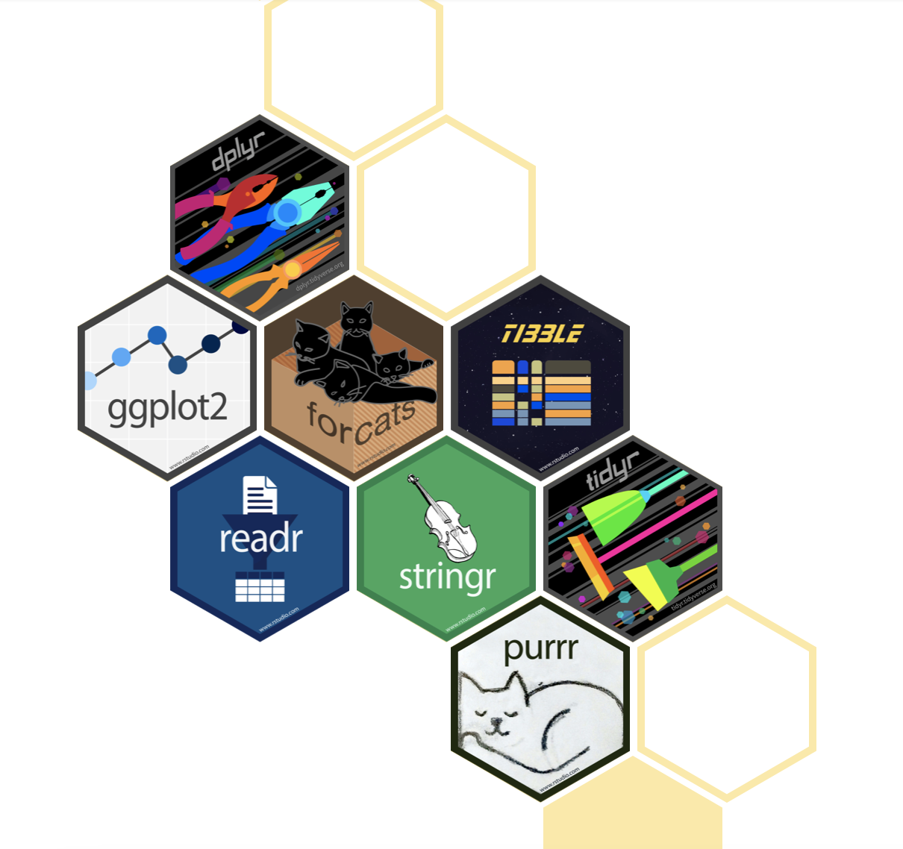

```{r xaringanExtra-clipboard, echo=FALSE}
xaringanExtra::use_clipboard()
```

# ¿Qué es el tidyverse?

.pull-left[
```{r, echo=FALSE,out.width='100%', fig.align='center'}

```
.center[<https://www.tidyverse.org>]
]

.pull-left[<br><br><br>
Colección de paquetes de R diseñados para ciencia de datos. 

Los paquetes comparten una filosofía de diseño, gramática y estructura de datos.
]


---
# ¿Cuáles paquetes lo componen?

## Tidyverse base
- **ggplot2**: creación dde gráficos
- **dplyr**: manipulación de datos
- **tidyr**: arreglo de datos tidy
- **readr**: lectura y escritura de datos tabulares
- purrr: programación funcional
- **tibble**: re-diseño de data frames
- **stringr**: manejo de texto (strings)
- forcats: manejo de factores

---
# ¿Cuáles paquetes lo componen?

## Lectura de datos
- **DBI**: bases de datos relacionales
- haven: SPSS, Stata, y SAS data
- httr: APIs web.
- **readxl**: lectura de .xls y .xlsx
- **googlesheets4**: lectura de Google Sheets
- googledrive: lectura de archivos de Google Drive
- rvest: web scraping.
- jsonlite: JSON
- xml2: lectura de XML

---
# ¿Cuáles paquetes lo componen?

.pull-left[
## Manejo de datos
- **lubridate**: manejo de fechas
- hms: zonas horarias.
- blob: almacenamiento de datos binarios

## Modelado
- **tidymodels**: modelado y machine learning
]

.pull-right[
## Programación
- **magrittr**: provee el pipe %>% y otros operadores especializados (%$%, %<>%)
- glue: alternativa al paste() para combinar datos y texto
]

---

# Paquetes del tidyverse en el análisis de datos

```{r, echo=FALSE, out.width='80%', fig.align='center'}
knitr::include_graphics("img/whytidyverse.png")
```
.center[Imagen tomada de [Why the tidyverse](https://rviews.rstudio.com/2017/06/08/what-is-the-tidyverse/) de Joseph Rickert]

---
# tibbles

```{r, message=FALSE, warning=FALSE}
library(dplyr)

df <- data.frame(x = letters, 
                 y = 1:26, 
                 z = sample(c(TRUE, FALSE), 26, replace = TRUE))

dt <- tibble(x = letters, 
                 y = 1:26, 
                 z = sample(c(TRUE, FALSE), 26, replace = TRUE))
```

---

## Diferencias entre data frame y tibble

.pull-left[
```{r}
head(df)
```

]

.pull-right[
```{r}
head(dt)
```
]

---

# Lectura y escritura de tibbles

```{r}
library(readr)

mediciones_clima <- read_csv("datos/clima.csv")
```

---

# Lectura y escritura de tibbles

```{r, eval=FALSE}
encabezado_clima <- head(mediciones_clima, 10)

write_csv(encabezado_clima, "datos/encabezado_clima.csv")
```

---

# Filtrado

```{r, warning=FALSE, message=FALSE, echo=FALSE}
library(datos)
```

```{r, eval=FALSE}
library(datos)

filter(pinguinos, especie == "Adelia")

filter(pinguinos, masa_corporal_g <= 3000)

filter(pinguinos, 
       masa_corporal_g <= 3300,
       especie == "Adelia")
```

---
# Selección

```{r, eval=FALSE}
select(pinguinos, "isla", "masa_corporal_g")

select(pinguinos, "especie", "largo_pico_mm", "alto_pico_mm")
```

---
# ¡Tu turno!

- Utiliza el tibble "aviones" del paquete datos.
- Filtra a los aviones construidos después del año 2000
- Filtra a los aviones construidos después del año 2000 con más de 100 asientos
- Selecciona las columnas "tipo", "modelo" y "asientos"

---
# Modificación

```{r, eval=FALSE}
mutate(pinguinos, 
       masa_corporal_kg = masa_corporal_g/1000)
```

```{r, echo=FALSE, out.width='40%', fig.align='right'}
knitr::include_graphics("img/mutate.png")
```

---
# Re ordenamiento de columnas

<br>
.pull-left[
```{r, eval=FALSE}
relocate(pinguinos, 
         masa_corporal_g, 
         .before = isla)

relocate(pinguinos, 
         masa_corporal_g, 
         .after = isla)
```
]

.pull-right[
```{r, echo=FALSE, out.width='100%', fig.align='right'}
knitr::include_graphics("img/relocate.png")
```
]

---
# Resumen de variables

```{r}
summarise(pinguinos, 
          mean(largo_pico_mm, na.rm = TRUE))
```

---

Aún mejor, asigna un nombre al resultado
```{r}
summarise(pinguinos, 
          promedio_largo_pico = mean(largo_pico_mm, 
                                     na.rm = TRUE))
```

---

Calcula más de un summarise
```{r}
summarise(pinguinos, 
          promedio_largo_pico = mean(largo_pico_mm, 
                                     na.rm = TRUE),
          desviacion_largo_pico = sd(largo_pico_mm, 
                                     na.rm = TRUE))
```


---
# ¡Tu turno!

- Utiliza el tibble "aviones" del paquete datos.
- Re ordena las columnas para situar al modelo del avión al inicio del tibble
- Obtén un resúmen con el mínimo, promedio y máximo de asientos

---
# ¿Cómo funciona summarise?

.center[Split-Apply-Combine]

```{r, echo=FALSE, out.width='70%', fig.align='center'}
knitr::include_graphics("img/split.png")
```

---
# Agrupación 

```{r}
pinguinos_agrupados <- group_by(pinguinos, especie)

summarise(pinguinos_agrupados,
          promedio_largo_pico = mean(largo_pico_mm, 
                                     na.rm = TRUE),
          desviacion_largo_pico = sd(largo_pico_mm, 
                                     na.rm = TRUE))
```

---

Podemos agrupar considerando más de una variable

```{r, eval=FALSE}
pinguinos_agrupados <- group_by(pinguinos, especie, isla)

summarise(pinguinos_agrupados,
          promedio_largo_pico = mean(largo_pico_mm,
                                     na.rm = TRUE),
          desviacion_largo_pico = sd(largo_pico_mm,
                                     na.rm = TRUE))
```

---
# ¡Tu turno!

- Utiliza el tibble "aviones" del paquete datos.
- Agrupa por fabricante y número de motores. 
- Usa el tibble agrupado y calcula el promedio de asientos

---
# Unión

- Crea el tibble 1

```{r, warning=FALSE, message=FALSE}
tibble1 <- read_csv("datos/tibble1.csv")

tibble1
```

---
- Crea el tibble 2

```{r, message=FALSE, warning=FALSE}
tibble2 <- read_csv("datos/tibble2.csv")

tibble2
```

---

- Conserva las líneas del primer tibble

```{r}
left_join(tibble1, tibble2)
```

---
- Conserva las líneas del segundo tibble

```{r}
right_join(tibble1, tibble2)
```

---
- Conserva las líneas en común

```{r}
inner_join(tibble1, tibble2)
```

---
- Conserva todas las líneas

```{r}
full_join(tibble1, tibble2)
```

---
# ¡Tu turno!

- Utiliza el tibble "aviones" del paquete datos.
- Agrupa por número de motores y genera un tibble con el promedio de asientos (tibble 1). 
- Filtra a los aviones y conserva a aquellos con más de 2 motores. Agrupa por número de motores y genera un tibble con el mínimo de asientos (tibble 2). 
- Prueba las diversas formas de unión y observa las diferencias.

---

.pull-left[<br><br><br><br><br><br><br>
.center[
# ¡Gracias!
]
]

.pull-right[<br><br><br><br>
```{r,echo=FALSE,out.width='100%',fig.align='center'}
knitr::include_graphics("img/gracias.png")
```

.pull-right[Ilustración de Allison Horst]
]
